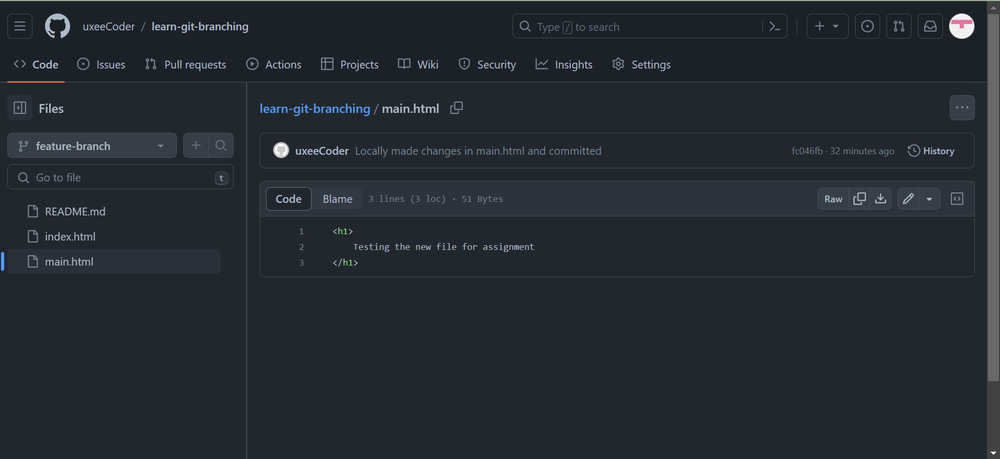
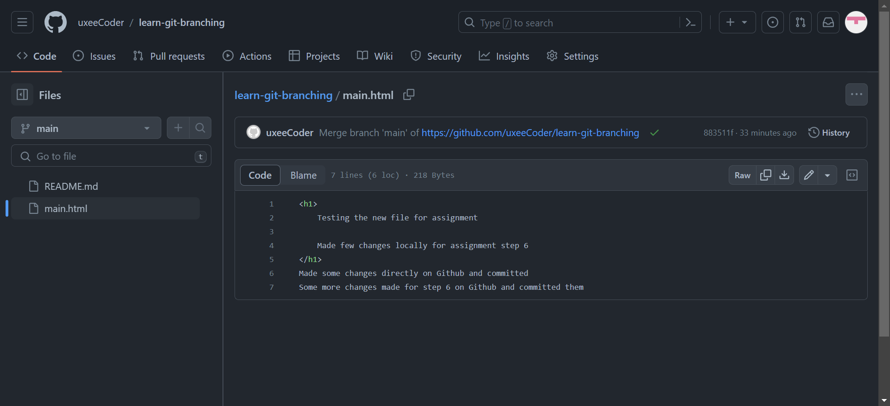

# learn-git-branching
## Objective: To learn how to interact with Git with the help of useful git commands.
### Steps to cover in today's assignment

- Introduction Sequence: Understanding the basics of Git with simple and foundational exercises.
- Ramping Up: A Deep dive into branching and learning how to manage multiple lines of work.
- Moving Work Around: Learning advanced techniques to manipulate the history and branches.

- ### Screenshot of completed exercise!
- 

## Take aways from the exercise:
### Git Commits
- A commit in a git repository records a snapshot of all the (tracked) files in your directory.
- It's like a giant copy and paste, commits are like snapshots of the project. Commits are very lightweight and switching between them is fast and easy!
### Git Branches
- Branches in Git are incredibly lightweight as well. They are simply pointers to a specific commit -- nothing more.
- A branch essentially includes the work of recent commit and all parent commits.
### Branches and Merging
- Its a way of combining the work from two different branches together. It allows to branch off, develop a new feature, and then combine it back in.
  ### Git Rebase
- Another way of combining work between branches is rebasing. Rebasing essentially takes a set of commits, "copies" them, and plops them down, the advantage of rebasing is that it can be used to make a nice linear sequence of commits.
### HEAD
- HEAD is the symbolic name for the currently checked out commit -- it's essentially what commit someone is working on top of.
- HEAD always points to the most recent commit which is reflected in the working tree. Most git commands which make changes to the working tree start by changing HEAD.

# Day -2 Exercise!

## Task: Complete levels shown below and attach screenshot after completion
- A Mixed Bag: This section covers a variety of important Git concepts and commands, providing a comprehensive review and practice.
- Advanced Topics: Dive into more complex Git topics and scenarios, challenging your understanding and skills.
### Screenshot

# Day -3 Exercise!
## Concentrated on completing the following sections in the "Remote" level:
Push & Pull -- Git Remotes!: This section helped practice the fundamentals of working with remote repositories, including pushing and pulling changes.
To Origin And Beyond -- Advanced Git Remotes, helped Dive into more advanced remote operations, enhancing skills in managing complex remote scenarios.

### Screenshot of completed exercise

# Git Rebase Assignment

## Steps to Follow:

### Step 1
- On your local learn-git-branching repository, create and switch to a new branch named feature-branch. 

- Make some changes in a file within feature-branch and commit them.

- Make some more changes in a file within feature-branch and DO NOT commit them.

- stash your changes using git stash.

### Screenshots of Step 1
- Adding Feature branch

- Make some changes to the and commit them

- Make more changes and DO NOT commit them

### Screenshots of step 2
- Locally, switch to the main branch and make different changes. Commit these changes.

- On GitHub, navigate to the same repository and make additional changes to the main branch. Commit these changes directly on GitHub.
.png>)

### Screenshots of step 3

- Switch back to the feature-branch
- Perform a rebase by executing git rebase main.
- Resolve any conflicts that arise, then continue with git rebase --continue.

### Screenshots of step 4
- Apply your stashed changes with git stash pop.
- Resolve any conflicts and make a new commit.

### Step 5: Configure Pull Behavior (Local):

- Set your local Git to merge by default during pulls with git config pull.rebase false.

### Step 6: Create Diverged Changes (Local and Remote):

- Locally, on the main branch, make and commit some changes.
- On GitHub, add different changes to the main branch and commit them.

### Step 7: Pull and Merge Changes (Local):
- Locally, execute git pull on the main branch.
- If a merge conflict occurs, resolve it and complete the merge.

## Reflect on Learning:
- Git branching helped learn how to manage differnet branches keeping the collaboration with different developers within a team. Learned how to switch merge rebase branches and how to handle and resolve merge conflicts when they arise.

